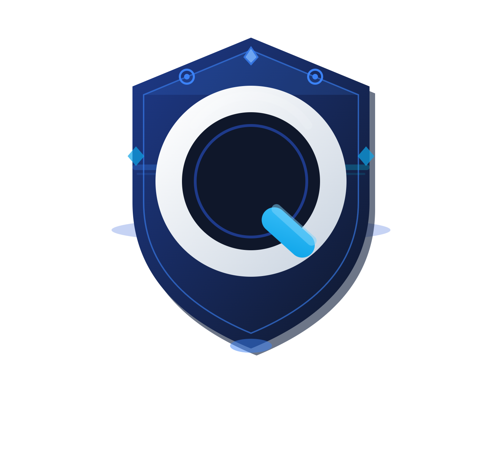

<html lang="en">
<head>
<meta charset="UTF-8">
<meta name="viewport" content="width=device-width, initial-scale=1.0">

</head>
<body>

<header>

<h1>Quality Mart</h1>

Premium Digital Marketplace

</header>

<nav>
<a href="#home">Home</a>
<a href="#services">Services</a>
<a href="#tos">Terms of Service</a>
<a href="#privacy">Privacy Policy</a>
<a href="#refund">Refund & Replacement</a>
</nav>

<section id="home">

<h2>Welcome</h2>

Quality Mart provides premium access to digital subscriptions including Spotify, Disney Plus, and other streaming platforms. We also offer Robux and various digital services.

<a href="https://discord.gg/KcUex5PqRW" target="_blank" style="background:#5865F2;padding:12px 20px;border-radius:8px;color:white;text-decoration:none;display:inline-block;">Join Our Discord</a>

</section>

<section id="services">

<h2>Our Services</h2>
<ul>
<li>Streaming Subscriptions</li>
<li>Gaming Products (Robux)</li>
<li>Digital Accounts</li>
</ul>

</section>

<section id="tos">

<h2>Terms of Service</h2>

<strong>1. Acceptance of Terms</strong> 
By accessing or using Quality Mart, you agree to be legally bound by these Terms. Use of the Service is prohibited if you do not agree.

<strong>2. Eligibility</strong> 
You must be at least 18 years old or the legal age in your jurisdiction.

<strong>3. Binding Arbitration & Class Action Waiver</strong> 
Any dispute, claim, or controversy arising out of or relating to the Service shall be resolved exclusively through binding arbitration conducted privately. You agree to waive any right to a jury trial or to participate in a class action lawsuit, class-wide arbitration, or representative action. All claims must be brought individually.

<strong>4. Limitation of Liability</strong> 
To the fullest extent permitted by law, Quality Mart shall not be liable for any damages, including loss of data, accounts, or service interruptions.

<strong>5. Indemnification</strong> 
You agree to indemnify and hold harmless Quality Mart from any claims resulting from your use of the Service.

<strong>6. Nature of Service</strong> 
We are not affiliated with any official providers. Services may be shared, resold, or third-party sourced.

<strong>7. Finality of Transactions</strong> 
All payments are final and non-refundable due to cryptocurrency usage.

<strong>8. Modifications</strong> 
We reserve the right to modify or terminate services at any time.

<strong>9. Agreement</strong> 
By checking the agreement box and proceeding with a purchase, you confirm full acceptance of these Terms.

<input type="checkbox" id="agree">
<label for="agree">I have read and agree to the Terms of Service</label>

This is a static demonstration checkbox. By selecting it, you acknowledge agreement for illustrative purposes.

</section>

<section id="privacy">

<h2>Privacy Policy</h2>

<strong>1. Data Collection</strong> 
We collect minimal information necessary to process transactions and provide services, including wallet addresses, transaction IDs, and communication data.

<strong>2. Use of Data</strong> 
Data is used solely for order fulfillment, support, fraud prevention, and service improvement.

<strong>3. Data Sharing</strong> 
We do not sell or share personal data with third parties except where required for fraud prevention or legal compliance.

<strong>4. Security</strong> 
We implement reasonable measures to protect user data but cannot guarantee absolute security.

<strong>5. User Responsibility</strong> 
Users must ensure their own operational security when interacting with cryptocurrency and accounts.

<strong>6. Changes</strong> 
We may update this policy at any time. Continued use constitutes acceptance.

</section>

<section id="refund">

<h2>Refund & Replacement Policy</h2>

<strong>1. No Refunds</strong> 
All sales are final due to the nature of digital goods and cryptocurrency payments.

<strong>2. Replacement Eligibility</strong> 
Replacements may be provided if the delivered product is proven non-functional at the time of delivery.

<strong>3. Verification</strong> 
Customers must provide sufficient proof (screenshots, recordings) within a reasonable timeframe.

<strong>4. Abuse</strong> 
Attempted fraud or abuse of the replacement system will result in denial of service and potential ban.

<strong>5. Final Decision</strong> 
All replacement decisions are made at the sole discretion of Quality Mart.

</section>

<section id="disclaimer">

<h2>Service Disclaimer</h2>

Quality Mart provides access to shared, private, or resold digital services. By purchasing, you acknowledge that:

<ul>
<li>Services may be shared or sourced through third parties</li>
<li>Access may be limited, modified, or revoked</li>
<li>We are not affiliated with official providers</li>
</ul>

By proceeding, you accept all associated risks.

</section>

<section id="kyc">

<h2>KYC & Anti-Fraud Policy</h2>

<strong>1. Fraud Prevention</strong> 
We reserve the right to request identity verification for suspicious transactions.

<strong>2. Refusal of Service</strong> 
We may refuse or cancel orders at our discretion if fraud is suspected.

<strong>3. Compliance</strong> 
Users must not engage in illegal activity, chargeback fraud, or abuse of cryptocurrency systems.

<strong>4. Enforcement</strong> 
Violations may result in permanent bans and reporting to relevant authorities where applicable.

</section>

<section id="business">

<h2>Business Information</h2>

Operating Name: Quality Mart

Type: Independent Digital Marketplace

Jurisdiction: Operated online under decentralized infrastructure

Contact: Official Discord Server

Note: Quality Mart operates as a private digital service provider and is not registered as an official distributor of any third-party brands mentioned.

</section>

<footer>

© 2026 Quality Mart. All rights reserved.

</footer>

</body>
</html>
